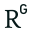

[Skip to content](#main)[New chat](https://chatgpt.com/)SearchPinnedRecents[Library](https://chatgpt.com/library)Invite team members
## Chat history
[ChatGPT](https://chatgpt.com/)

- [New chatCtrlShiftO](https://chatgpt.com/)
-

[Scheduled](https://chatgpt.com/scheduled)[Library](https://chatgpt.com/library)[Plugins](https://chatgpt.com/plugins)[Agents](https://chatgpt.com/agents)[Codex](https://chatgpt.com/codex)[GPTs](https://chatgpt.com/gpts)
## Pinned

- [Wan Cinematic Video Prompt Generator](https://chatgpt.com/g/g-67c3a6d6d19c81919b3247d2bfd01d0b-wan-cinematic-video-prompt-generator)

## Projects

- Augmented Transformer
- ANNs
- Astronomy & Cosmology
- Hamming Centrality Paper
- Physics & Chemistry
- Show more

## Chats
[](https://chatgpt.com/)

- [LLM Memory Paging Challenge](https://chatgpt.com/c/6a67ccea-9a84-83ea-8fbf-8698792a9bcc)
- [Multi-line Prompts Codex CLI](https://chatgpt.com/c/6a67d722-58b0-83ea-ac33-50fdac5f10c2)
- [Model2Vec Output Type](https://chatgpt.com/c/6a66db9b-51bc-83ea-b2f4-f9f50a3a0523)
- [Laguna XS.2 Autocompaction Issue](https://chatgpt.com/c/6a67a4f0-5b3c-83ea-bd28-362f72322bb4)
- [Branch · CNN Topologies Overview](https://chatgpt.com/c/6a66c4a0-5200-83ea-b8ea-36ff17b9902f)
- [Stable Diffusion Denoising Process](https://chatgpt.com/c/6a66d543-b9a8-83ea-87ab-9cd92c2a4575)
- [Merging Transformer Models](https://chatgpt.com/c/6a66a9ee-02c8-83ea-a47b-6079aca8fb18)
- [Decision vs Language Transformer](https://chatgpt.com/c/6a668895-f384-83ea-8e79-6903e7f07ba0)
- [Length Generalization in LLMs](https://chatgpt.com/c/6a66748b-2e2c-83ea-a249-eb00e6c06434)
- [Merging Stable Diffusion Models](https://chatgpt.com/c/6a65974d-5a58-83ea-9f8b-730e1be65f1a)
- [Branch · Merging Stable Diffusion Models](https://chatgpt.com/c/6a65b5da-7848-83ea-ab3b-292fbf9aafb4)
- [DSpark vs Hypernetworks](https://chatgpt.com/c/6a6530eb-4d2c-83ea-b049-a8fc1724a637)
- [Transformer Cognitive Activities](https://chatgpt.com/c/6a6583ca-eaec-83ea-acf8-b266eacac3d0)
- [Nvidia DGX Spark Fallout](https://chatgpt.com/c/6a651e96-0958-83ea-a580-831136b44d35)
- [CUDA architecture mismatch](https://chatgpt.com/c/6a64ffa6-354c-83ea-bb98-0fc75d8abdd7)
- [Enable tools in vLLM](https://chatgpt.com/c/6a642436-e814-83ea-890a-92312b157f63)
- [vLLM MiniMax Configuration](https://chatgpt.com/c/6a62c8b8-9010-83ea-a234-7fb0313264da)
- [DGX Spark Compatibility](https://chatgpt.com/c/6a5fdce5-6734-83ea-9d6f-52a8493b7da4)
- [Staged Pretraining in Transformers](https://chatgpt.com/c/6a615bbb-b600-83ea-83ff-52cb4a113fde)
- [Improving Nemotron with NoRobot](https://chatgpt.com/c/6a623d0d-2f20-83ea-bd13-1e66837bf8e2)
- [Nemotron Token speed debugging](https://chatgpt.com/c/6a5bd10b-826c-83ea-a9d2-89a053b934e9)
- [Agent Harness Evaluation](https://chatgpt.com/c/6a617f57-2bdc-83ea-99bf-cc1db017c2c0)
- [Token Statistics in Corpora](https://chatgpt.com/c/6a610ca3-c34c-83ea-b584-a4a8c32fb1e5)
- [Mullvad vs Proton VPN](https://chatgpt.com/c/6a60f5c5-adbc-83ea-9c1b-f5cb772e5ea8)
- [Dataset download error](https://chatgpt.com/c/6a60cb38-f6ac-83ea-81c6-68b2113d573a)
- [Codex openai_base_url 설정](https://chatgpt.com/c/6a602cb3-a99c-83ea-b9b4-701d3d06ea36)
- [TMax Model Explanation](https://chatgpt.com/c/6a5fc879-3760-83ea-b607-d54bf51349c5)
- [EMO Model Capabilities](https://chatgpt.com/c/6a5fd761-2998-83ea-ab5c-ab9e9b2f1c97)

orgwolfBusinessInvite team membersShare
#### You said:
Sol_RFC(3).mdFileCould this RFC work as a foundation for such a system?

#### ChatGPT said:

Correct. **Set theory is the semantic foundation; logical operators are the execution and optimization representation.** I compressed those layers too much.

In the classical relational model, a relation is mathematically a set of tuples. A declarative query describes the relation to be returned, using concepts grounded in set theory and predicate logic. Codd’s original model introduced n-ary relations, normalization, and operations over relations while deliberately separating the user’s logical view from physical storage. [IBM Research+1](https://research.ibm.com/publications/a-relational-model-of-data-for-large-shared-data-banks?utm_source=chatgpt.com)

There are three relevant layers:

```

```
Declarative semantics
Relational calculus / predicate logic
“Which tuples satisfy this condition?”

Mathematical query model
Relational algebra
selection, projection, join, union, difference, etc.

Physical execution
index scan, sequential scan, hash join,
merge join, nested-loop join, sorting, paging
```

```

So a query might begin declaratively as:

$$
\{c \mid Claim(c)\land c.status=\text{current}
\land \exists e(Evidence(e)\land Supports(e,c))\}
$$

That says what set of claims is wanted.

The DBMS then translates it into a relational-algebra expression:

$$
\pi_{\text{claim}}
\left(
\sigma_{\text{status=current}}(\text{Claims})
\bowtie
\text{Supports}
\bowtie
\text{Evidence}
\right)
$$

The optimizer represents that expression internally as a tree of **logical operators**. It can then apply equivalence transformations—push selections downward, reorder joins, remove unused projections—and finally choose physical operators. PostgreSQL, for example, constructs alternative plans from sequential scans, index scans, join nodes, sorts, and aggregates, then selects an estimated-cheapest plan that produces the same result. [PostgreSQL](https://www.postgresql.org/docs/current/planner-optimizer.html?utm_source=chatgpt.com)

So “logical operator algebra” was not entirely wrong, but it was incomplete. The more precise phrase is:

>

**A declarative relational or set-theoretic query model, represented internally by a logical operator algebra and compiled into a physical execution plan.**

There is one practical qualification: SQL implementations do not operate under pure set semantics everywhere. Ordinary `SELECT` retains duplicates by default, so SQL frequently uses **bag or multiset semantics**; `DISTINCT` explicitly restores set-like duplicate elimination. `UNION`, `INTERSECT`, and `EXCEPT` eliminate duplicates by default unless `ALL` is specified. [PostgreSQL+1](https://www.postgresql.org/docs/current/sql-select.html?utm_source=chatgpt.com)

For Sol, I would therefore revise my proposed companion RFC from merely an “operator model” to something like:

## SOL-QRY: Declarative Query Semantics

It would define:

-

domains and relation schemas;

-

sets, bags, and ordered sequences;

-

identity and equality;

-

predicates and quantification;

-

joins and graph relations;

-

temporal relations;

-

provenance-bearing relations;

-

null, unknown, unavailable, and stale truth states;

-

aggregation;

-

semantic or probabilistic predicates;

-

the relation between logical queries and physical plans.

Then a separate planning specification would define the logical and physical operators.

That separation matters because Sol already supplies canonical, independently addressable records and structured indexes.
Sol_RFC

Sol_RFC
The query language should describe **sets or relations over those records**, without exposing whether the answer is obtained through an index, graph traversal, semantic search, cached summary, or scan.

The especially interesting problem for an AI-oriented DBMS is that some predicates are exact:

```

```
record.status.staleness = "current"
created_at < revision_time
supports(evidence, claim)
```

```

while others are probabilistic:

```

```
claim is materially relevant to question Q
event semantically contradicts event E
two entities probably refer to the same organization
```

```

The clean approach is not to discard set theory, but to extend the relational model with typed semantic predicates whose uncertainty and provenance are explicit. The optimizer can then choose whether to evaluate a predicate through:

-

an exact index;

-

a conventional relation;

-

a graph;

-

a vector index;

-

an LLM;

-

or a verified combination.

So the corrected architectural stack is:

```

```
Set theory + predicate logic
↓
Declarative relational query
↓
Relational/logical algebra
↓
Cost-based logical rewrites
↓
Physical operator plan
↓
Indexes, paging, caches, storage, and model calls
```

```

**Set theory defines the answer. Operators define how the system computes it.**
Sources

#### You said:
Let's elaborate on the design of each aspect, logical and set theoretical, for a SOL-QRY2/2

#### ChatGPT said:
Worked for 8m 19s
Yes. The clean design is **three layers, not two**:

1.

A **set-theoretic and model-theoretic data model** defines what exists and what a query result means.

2.

A **logical query language** defines derived relations declaratively.

3.

A **logical algebra** gives an equivalent compositional representation that an optimizer can rewrite.

A fourth layer—physical operators, indexes, paging, caching, and model execution—belongs in `SOL-PLAN`, not `SOL-QRY`.

That separation is the central design rule:

$$
\text{meaning}
\;\rightarrow\;
\text{logical expression}
\;\rightarrow\;
\text{logical plan}
\;\rightarrow\;
\text{physical execution}
$$

Codd’s original relational model deliberately separated the logical representation of data from its physical organization and introduced relations and normalization as the user-facing model. His later calculus work distinguished high-level declarative languages from algebraic and procedural ones; relational calculus and relational algebra provide two equivalent ways to express the relational core. [IBM Research+2IBM Research+2](https://research.ibm.com/publications/a-relational-model-of-data-for-large-shared-data-banks?utm_source=chatgpt.com)

Sol is already a good substrate because it makes structured artifact state canonical, independently addresses records and objects, and treats rendering as derived rather than authoritative.
Sol_RFC

Sol_RFC

# 1. Proposed SOL-QRY invariants

These would be the foundation before defining syntax.

The physical engine is then free to use a B-tree, graph traversal, machine summary, object fetch, vector index, full scan, or model call, provided it satisfies those invariants.

# 2. Set-theoretic foundation

## 2.1 Typed universes rather than one untyped value space

SOL-QRY should use a many-sorted model.

Let the domains include, at minimum:

$$
\begin{aligned}
D_{\text{ArtifactId}},\;
D_{\text{CommitId}},\;
D_{\text{BranchId}},\;
D_{\text{CellId}},\;
D_{\text{RecordId}},\\
D_{\text{ObjectRef}},\;
D_{\text{ActorId}},\;
D_{\text{RunId}},\;
D_{\text{Time}},\;
D_{\text{String}},\;
D_{\text{Number}},\ldots
\end{aligned}
$$

The total universe is a disjoint union:

$$
D=\biguplus_{\tau\in Types}D_\tau
$$

This makes accidental comparisons invalid. For example:

```

```
record:claim_007 = cell:claim_007
```

```

is not false; it is ill-typed.

References should have parameterized types such as:

```

```
Ref<Cell>
Ref<Claim>
Ref<Evidence>
Ref<Object>
Ref<AnyRecord>
```

```

A generic `Ref<Any>` can exist at interchange boundaries, but typed relations should narrow it before use.

## 2.2 A Sol commit denotes a finite database instance

For artifact $a$ at commit $c$, define:

$$
I_{a,c}
$$

as the complete logical database instance represented by that committed artifact state.

A query is then a function:

$$
Q : I_{a,c} \mapsto R
$$

where $R$ is a finite relation.

A branch name is not itself a stable query coordinate. At query start:

$$
\operatorname{head}(a,b)\rightarrow c
$$

must be resolved atomically, and the query must thereafter operate on $I_{a,c}$. This follows Sol’s existing snapshot model: a run reads a stable committed snapshot, while branch commits are serialized and conflicts require rejection, branching, merging, or rebasing.
Sol_RFC

Sol also states that commit ancestry, not timestamp ordering, is authoritative. SOL-QRY should preserve that rule.
Sol_RFC

For federation, a source is not merely a collection of artifact names. It is a frozen source manifest:

```
JSON
```
{
"sources": [
{
"artifact_id": "art_A",
"commit_id": "commit_042",
"alias": "evaluation"
},
{
"artifact_id": "art_B",
"commit_id": "commit_119",
"alias": "contracts"
}
]
}
```

```

The federated instance is conceptually:

$$
I_F=\biguplus_{(a,c)\in F} I_{a,c}
$$

with artifact-qualified identities.

## 2.3 Two logical schemas: snapshot state and history

SOL-QRY should expose two related schemas.

### Snapshot schema

This represents one artifact at one selected commit:

```

```
sol_state.Artifact
sol_state.Cell
sol_state.Record
sol_state.Claim
sol_state.Evidence
sol_state.Decision
sol_state.Verification
sol_state.Run
sol_state.Object
sol_state.Actor
sol_state.Dependency
sol_state.OutputBinding
...
```

```

Commit coordinates do not need to appear in every tuple because the source snapshot is already bound.

### History schema

This exposes version structure:

```

```
sol_history.Commit
sol_history.CommitParent
sol_history.Branch
sol_history.BranchHead
sol_history.VisibleAt
sol_history.ChangedAt
sol_history.RunAtCommit
...
```

```

This distinction matters. Most questions concern one state:

>

Which decisions currently need reverification?

Some concern history:

>

At which commit did this claim first become stale?

The query engine should not force ordinary snapshot queries to reason through the entire commit graph.

## 2.4 A normalized logical projection of Sol

The physical `.solnb` need not become a relational file. Logical normalization should be independent of physical serialization—exactly the kind of separation the relational model was designed to provide. [IBM Research+1](https://research.ibm.com/publications/a-relational-model-of-data-for-large-shared-data-banks?utm_source=chatgpt.com)

A candidate normalized core looks like this:

```

```
Record(
record_id,
record_type,
summary,
created_by,
created_at
)

RecordStatus(
record_id,
lifecycle,
staleness,
verification
)

Claim(
record_id,
statement,
claim_type,
confidence,
confidence_basis
)

Evidence(
record_id,
evidence_type,
source_ref,
source_object
)

Supports(
evidence_id,
claim_id
)

RecordDependency(
dependent_ref,
dependency_ref,
dependency_kind
)

Decision(
record_id,
decision_type,
selected,
decision_rule,
made_by
)

DecisionCandidate(
decision_id,
candidate_ref
)

DecisionBasis(
decision_id,
basis_ref
)

Cell(
cell_id,
cell_type,
title,
summary,
source_hash,
contract_hash,
actor_id
)

CellDependency(
cell_id,
upstream_ref
)

LinearCellPosition(
ordinal,
cell_id
)

ExecutionEdge(
from_cell,
to_cell
)

OutputContract(
cell_id,
output_name,
mime_type,
schema_ref
)

OutputBinding(
run_id,
cell_id,
output_name,
object_ref,
mime_type
)
```

```

Arrays in the artifact map to relations. An array whose order is meaningful receives an ordinal. An array that represents a set does not.

For example:

```
JSON
```
"supporting_evidence": [
"record:evidence_011",
"record:evidence_012"
]
```

```

becomes:

```

```
Supports(evidence_011, claim_007)
Supports(evidence_012, claim_007)
```

```

The RFC already makes semantic records independently identified and prohibits anchor cells from duplicating canonical record content, which is precisely the structure needed for this normalization.
Sol_RFC

## 2.5 Sets, bags, and sequences must be distinct

The default relation should be a mathematical set:

$$
R\subseteq D_{\tau_1}\times\cdots\times D_{\tau_n}
$$

Duplicate tuples do not exist.

That does not prevent recording repeated events. Each event has a distinct identity:

```

```
MessageEvent(event_001, ...)
MessageEvent(event_002, ...)
```

```

Even when their content is identical, the tuples differ by event identity.

SOL-QRY should support three explicit result kinds:

```

```
SET<T>
BAG<T>
SEQUENCE<T>
```

```

Their meanings differ:

-

`SET<T>` contains each tuple at most once.

-

`BAG<T>` associates a nonnegative multiplicity with each tuple.

-

`SEQUENCE<T>` associates each element with an order position.

A relation is never implicitly ordered. Linear execution order is modeled by a relation such as:

```

```
LinearCellPosition(ordinal, cell_id)
```

```

An `ORDER BY` operation transforms a relation into a sequence. For deterministic committed results, the ordering key must be total. Ties should be resolved using a stable identity.

`LIMIT 10` without an order should either be invalid for committed results or explicitly marked as an arbitrary, nondeterministic sample.

## 2.6 Generalize relations as finite-support annotated relations

A useful mathematical foundation is a $K$-relation:

$$
R_K :
D_{\tau_1}\times\cdots\times D_{\tau_n}
\rightarrow K
$$

where all but finitely many tuples map to zero.

Different annotation structures produce different semantics:

Semiring provenance showed that positive relational algebra can propagate a variety of annotations—including bag and provenance interpretations—through a common algebraic framework. [ResearchGate+1](https://www.researchgate.net/publication/221559651_Provenance_Semirings?utm_source=chatgpt.com)

For SOL-QRY, the default is:

$$
K=\mathbb B=\{0,1\}
$$

A query requesting derivation provenance can instead evaluate over a provenance semiring whose variables identify base records, objects, or evaluations.

This is especially natural for Sol because dependencies, evidence, provenance, and staleness are already first-class artifact concepts.
Sol_RFC

Sol_RFC

## 2.7 Identity must not be confused with semantic equivalence

SOL-QRY needs at least four equality-like concepts.

### Exact scalar equality

```

```
"active" = "active"
42 = 42
```

```

### Exact object identity

Two `object:` references are equal when their canonical content-addressed identities are equal.

### Logical reference identity

A named output such as:

```

```
cell:cell_014#metrics_table
```

```

is a stable logical reference. It is not equal to the immutable object to which it currently resolves. Sol already distinguishes named outputs from concrete object identities.
Sol_RFC

### Semantic equivalence

Claims, entities, or passages that appear to mean the same thing must be connected through an explicit relation:

```

```
SemanticEquivalent(
left_ref,
right_ref,
evaluation_id,
label,
score,
evaluator_id
)
```

```

A semantic-equivalence relation may support a join. It must never silently redefine `=`.

Similarly, entity resolution should produce relations such as:

```

```
PossibleSameEntity(a, b, assessment_id, confidence)
CanonicalizesTo(alias, entity_id, policy_id)
```

```

rather than merging identities invisibly.

## 2.8 Missing, unknown, redacted, and unavailable are different values

SOL-QRY should not inherit one overloaded SQL-style `NULL`.

A typed optional value should have explicit tagged states:

```

```
present(value)
absent
unknown
redacted
unavailable
unresolved
```

```

Their meanings differ:

-

`absent`: the field is not applicable or was not supplied.

-

`unknown`: a value exists but is not known.

-

`redacted`: policy prevents disclosure.

-

`unavailable`: an external object or source cannot currently be retrieved.

-

`unresolved`: a reference was syntactically present but did not resolve.

Predicates should be explicit:

```

```
IS ABSENT
IS UNKNOWN
IS REDACTED
IS UNAVAILABLE
IS UNRESOLVED
```

```

A redacted value must not compare equal to an unknown value, and neither should be treated as the empty string.

## 2.9 Artifact truth and world truth must be separated

This is one of the most important distinctions.

The following tuple may certainly exist:

```

```
Claim(claim_007, "The customer accepted the clause.")
```

```

That means:

>

The artifact contains a claim record asserting this proposition.

It does **not** mean:

>

The customer certainly accepted the clause.

Contradictory claims do not necessarily make the artifact database inconsistent:

```

```
Claim(claim_007, "The customer accepted the clause.")
Claim(claim_009, "The customer rejected the clause.")
```

```

Both tuples can be accurate descriptions of what two actors asserted.

SOL-QRY should therefore distinguish at least two levels.

### Assertion layer

This is an exact, two-valued database of artifact records:

```

```
Claim
Evidence
Verification
Decision
Review
Failure
```

```

Queries over this layer ask:

>

What has been recorded?

### World-assessment layer

This derives accepted propositions under an explicit policy:

```

```
AcceptedFact(policy_id, proposition_id)
RejectedFact(policy_id, proposition_id)
ConflictedFact(policy_id, proposition_id)
UndeterminedFact(policy_id, proposition_id)
```

```

Queries over this layer ask:

>

What should be regarded as true under this evidence and assessment policy?

The current Sol status model provides lifecycle, staleness, and verification dimensions. Those are useful inputs to assessment, but they are not themselves a complete truth logic.
Sol_RFC

In particular:

-

`unverified` does not mean false;

-

`failed_verification` does not necessarily mean the negation is proven;

-

`stale` does not mean historically false;

-

`withdrawn` describes lifecycle, not logical negation;

-

`confidence: 0.8` is not an 80% membership value unless a probability model says it is.

A future claim-assessment extension could use a two-bit support state:

$$
(s^+,s^-)\in\{0,1\}^2
$$

giving:

The existing RFC defines `supports` but does not define a general `refutes` relationship, so that four-state assessment would require an extension rather than reinterpretation of existing fields.

## 2.10 Open-world and closed-world relations

Each relation should declare a world assumption.

```
JSON
```
{
"relation": "sol_state.Record",
"world_assumption": "closed",
"completeness": "exact_at_snapshot"
}
```

```

Possible declarations might include:

```

```
closed
open
policy_scoped
approximate
externally_incomplete
```

```

Their effects:

-

In a closed relation, absence can imply nonmembership.

-

In an open relation, absence means only “not asserted here.”

-

In a policy-scoped relation, absence may result from authorization filtering.

-

In an approximate relation, an access method may omit matching tuples.

-

In an externally incomplete relation, the source may not represent the complete world.

This is essential for negation.

```

```
NOT EXISTS Evidence(e)
```

```

has classical meaning only if `Evidence` is complete for the relevant universe and policy.

Otherwise SOL-QRY should distinguish:

```

```
NOT ASSERTED Evidence(e)
CERTAINLY NOT Evidence(e)
NO VISIBLE Evidence(e)
```

```

Those are not equivalent.

Incomplete-information database theory commonly gives semantics through a set of admissible possible worlds. [SIGMOD+1](https://www.sigmod.org/publications/dblp/db/journals/jacm/ImielinskiL84.html?utm_source=chatgpt.com)

For an assessment policy $p$, let:

$$
\Omega_p(I)
$$

be the set of admissible worlds represented by artifact state $I$. Then:

$$
\operatorname{Certain}_p(Q,I)
=
\bigcap_{W\in\Omega_p(I)}Q(W)
$$

and:

$$
\operatorname{Possible}_p(Q,I)
=
\bigcup_{W\in\Omega_p(I)}Q(W)
$$

This suggests explicit query modes:

```

```
ASSERTED
CERTAIN UNDER <policy>
POSSIBLE UNDER <policy>
```

```

For a first SOL-QRY version, `ASSERTED` can be fully normative while `CERTAIN` and `POSSIBLE` are reserved for a later assessment profile.

## 2.11 Time requires two distinct dimensions

SOL-QRY should distinguish at least:

1.

**Artifact or transaction time**: when a fact or record was present in a committed Sol state.

2.

**Valid time**: when the modeled proposition was true in the represented world.

Temporal database work traditionally distinguishes transaction time from valid time for precisely this reason. [SIGMOD+1](https://sigmod.org/publications/dblp/db/journals/vldb/TorpJS00.html?utm_source=chatgpt.com)

For Sol:

```

```
AT COMMIT commit_042
```

```

means evaluate over the artifact state $I_{a,commit\_042}$.

A semantic fact might separately carry:

```

```
valid_from
valid_to
```

```

and be queried using:

```

```
VALID AT 2026-07-21T14:00:00Z
```

```

The combined query:

```

```
AT COMMIT commit_042
VALID AT 2026-07-21T14:00:00Z
```

```

means:

>

Using what the artifact recorded at commit 42, return facts asserted to be valid at the given world time.

These must not be collapsed into one timestamp.

On a branching commit graph, artifact visibility is not necessarily a simple timestamp interval. The fundamental operation is:

```

```
VisibleAt(ref, commit)
```

```

A linear branch may optimize this to intervals, but that is a physical representation choice.

## 2.12 Constraints are logical sentences, not comments

Each registered relation should declare:

-

candidate keys;

-

foreign keys;

-

functional dependencies;

-

check constraints;

-

temporal constraints;

-

exclusion constraints;

-

lifecycle constraints;

-

authorization constraints.

For example:

$$
record\_id \rightarrow record\_type,created\_by,created\_at
$$

$$
(run\_id,cell\_id,output\_name)\rightarrow object\_ref
$$

```

```
Supports.evidence_id REFERENCES Evidence.record_id
Supports.claim_id REFERENCES Claim.record_id
```

```

```

```
A named output has at most one current valid binding
per selected snapshot.
```

```

Sol’s validator already defines many artifact-level integrity rules, including reference resolution, commit ancestry, output binding validity, legal status transitions, proposal application, and rendering honesty.
Sol_RFC

A crucial optimizer rule follows:

>

A query rewrite may rely only on constraints that are enforced or verified at the selected commit.

A merely asserted constraint cannot justify join elimination or cardinality assumptions.

# 3. Logical foundation

## 3.1 Canonical semantics should use a typed relational calculus

The normative meaning of a SOL-QRY query should be a typed, range-restricted relational-calculus expression.

A query has the form:

$$
Q(\bar x)
=
\{\bar x\mid \varphi(\bar x)\}
$$

where $\varphi$ is a logical formula over the selected Sol instance.

A minimal formula grammar is:

$$
\begin{aligned}
\varphi ::= {}&
R(t_1,\ldots,t_n)\\
&\mid t_1=t_2\\
&\mid t_1<t_2\\
&\mid \varphi\land\varphi\\
&\mid \varphi\lor\varphi\\
&\mid \neg\varphi\\
&\mid \exists x:\tau.\varphi\\
&\mid \forall x:\tau.\varphi
\end{aligned}
$$

A surface language may resemble SQL, Datalog, comprehensions, or a graphical query builder. The canonical interchange representation should be a typed AST, not one particular textual syntax.

This gives Sol the same separation it already applies to rendering:

```

```
human query syntax
↓
canonical query AST
↓
logical plan
↓
physical execution
```

```

## 3.2 Query safety and domain independence

Unrestricted first-order formulas can describe results that depend on the existence of values outside the stored database. A database query must be safe and domain-independent.

Candidate safety rules:

-

Every returned variable must be bound by a positive relation atom.

-

Every variable appearing in a negated subformula must be bound outside that subformula.

-

Every aggregate input variable must range over a finite relation.

-

Universal quantification must be over an explicit finite domain relation.

-

Functions must not synthesize an unbounded domain.

-

Reference traversal must range over resolvable references in the selected source manifest.

Valid:

```

```
{ c |
Claim(c)
∧ ¬∃e (Evidence(e) ∧ Supports(e,c))
}
```

```

provided `Evidence` and `Supports` are closed and `c` is positively bound.

Unsafe:

```

```
{ x | ¬Claim(x) }
```

```

because it asks for every possible value that is not a claim.

## 3.3 Named rules and recursion

Sol contains graph-shaped structures:

-

execution graphs;

-

dependency graphs;

-

commit ancestry;

-

provenance chains;

-

supersession chains;

-

evidence relationships.

SOL-QRY therefore needs recursion.

The clean model is positive Datalog-style least-fixed-point evaluation:

```

```
ancestor(older, newer) :-
commit_parent(newer, older).

ancestor(older, newer) :-
commit_parent(newer, middle),
ancestor(older, middle).
```

```

The meaning is the least fixed point satisfying the rules.

Datalog is the established database language for recursive querying, with extensive work on recursion, optimization, incremental maintenance, aggregates, and controlled negation. [DOI+1](https://doi.org/10.1561/1900000017?utm_source=chatgpt.com)

SOL-QRY should support:

```

```
positive recursion
stratified negation
stratified aggregation
```

```

It should initially avoid unrestricted recursion through negation because its semantics and optimization are considerably harder.

## 3.4 Negation must expose the world assumption

The syntax should distinguish three operations.

### Set difference

```

```
A EXCEPT B
```

```

This is valid when both operands are exact closed sets under the same snapshot and visibility policy.

### Absence from the artifact

```

```
NOT ASSERTED R(x)
```

```

This means no visible tuple is stored.

### Epistemic negation

```

```
CERTAINLY NOT P(x) UNDER policy
```

```

This means the negated proposition holds in every admissible world under the selected assessment policy.

These should never be silently interchangeable.

For the positive algebra, semiring annotations compose naturally. Difference and negation require extra algebraic structure or restricted semantics, which is another reason to keep the initial core conservative. [DOI](https://doi.org/10.1145/3736229.3736253?utm_source=chatgpt.com)

## 3.5 Aggregation needs explicit multiplicity semantics

SOL-QRY should define:

```

```
COUNT_SET
COUNT_BAG
SUM
MIN
MAX
AVG
COLLECT_SET
COLLECT_BAG
```

```

Plain `COUNT` is too ambiguous for a language that supports both sets and bags.

For a set relation:

```

```
COUNT_SET(Claim)
```

```

counts distinct tuples.

To count events that happen to have identical content, the event ID remains part of the tuple.

Aggregation over an open-world or approximate relation must state what it counts:

```

```
COUNT ASSERTED Evidence
COUNT VISIBLE Evidence
CERTAIN COUNT Evidence
POSSIBLE COUNT Evidence
```

```

The last two may produce a range rather than a scalar:

```
JSON
```
{
"lower_bound": 7,
"upper_bound": 12
}
```

```

A first version can support exact aggregation over `ASSERTED` relations and defer uncertain aggregates.

## 3.6 Temporal query operators

Candidate temporal constructs:

```

```
AT COMMIT <commit-ref>
ON BRANCH <branch-ref>
KNOWN AT <commit-ref>
VALID AT <instant>
VALID DURING <interval>
CHANGED BETWEEN <commit-a> AND <commit-b>
INTRODUCED BY <commit>
SUPERSEDED BEFORE <commit>
```

```

`ON BRANCH main` must resolve to a commit at evaluation start and record that resolved commit in the query result.

`LATEST` should be prohibited unless the query specifies:

-

a branch;

-

a descendant relation;

-

a deterministic tie policy.

Timestamps alone do not define “latest” in a branching history.

## 3.7 Semantic predicates should be relation-valued operations

An LLM or embedding model should not appear as a magical Boolean predicate:

```

```
WHERE semantically_same(a, b)
```

```

unless the evaluator and its semantics are fixed.

Instead, semantic evaluation should produce a relation:

```

```
SemanticAssessment(
evaluation_id,
left_ref,
right_ref,
label,
score,
evaluator_actor,
model_id,
configuration_digest,
evidence_ref,
created_at
)
```

```

The query can then operate exactly over the resulting data:

```

```
SemanticAssessment(e, a, b, "equivalent", score, ...)
AND score >= 0.95
```

```

This preserves the distinction between:

1.

the stochastic or heuristic process that generated the assessment; and

2.

the deterministic query over the committed assessment.

A semantic evaluator contract should declare:

```
JSON
```
{
"evaluator_id": "sol:evaluator/semantic_equivalence/v1",
"input_schema": "...",
"output_schema": "...",
"determinism": "stochastic",
"guarantee": "heuristic",
"model_actor": "agent:semantic_matcher_001",
"configuration_digest": "digest:sha256:...",
"monotonicity": "unknown",
"cache_key_fields": [
"left_ref",
"right_ref",
"configuration_digest"
]
}
```

```

An inline evaluation may be permitted, but the result must be materialized as part of the query run if the query result is committed.

This is the database analogue of turning model calls into inspectable operators rather than hiding them inside application code.

## 3.8 Exactness and resource budgets are separate dimensions

The mathematical denotation of a query is independent of execution cost.

A query execution contract should state one of:

```

```
exact
sound_subset
complete_superset
heuristic
unknown
```

```

Their meanings:

A budgeted query might say:

```
JSON
```
{
"answer_guarantee": "sound_subset",
"budget": {
"max_object_bytes": 104857600,
"max_semantic_evaluations": 20,
"max_wall_time_ms": 5000
}
}
```

```

The engine may then stop early, but it cannot label the result exact.

This is the correct place to express the compute–I/O tradeoff we discussed. Paging affects execution cost, not denotation.

## 3.9 Query views and materialized views

A logical view is a named query:

```

```
VIEW CurrentVerifiedClaims AS ...
```

```

A materialized view adds:

```

```
source commits
query digest
result object
dependency closure
refresh state
staleness state
provenance
```

```

Sol’s machine summary is already close to a built-in materialized view. It serializes Levels 0–2, is tied to a source commit, is intended for bounded-context consumers, and is invalid if it diverges from artifact state.
Sol_RFC

A SOL-QRY optimizer may use the machine summary as a covering view when:

-

the query refers only to fields contained in the summary;

-

the source commit matches;

-

summary integrity has been validated;

-

no omitted detail is needed.

It may not treat the summary as canonical truth. The artifact remains canonical.

## 3.10 SOL-QRY should be read-only

A query can produce a relation, object, report, proposal, or diagnostic. It should not mutate canonical state directly.

For example:

```

```
QUERY stale_decisions
→ result relation
→ proposal to mark decisions for review
→ review
→ committed update
```

```

This preserves Sol’s existing proposal, review, authorization, and commit machinery rather than creating a second mutation model.

# 4. Logical algebra

The logical algebra is not the physical plan. Its operators are declarative and implementation-independent.

## 4.1 Core positive algebra

Set difference should be present only under a relation-completeness contract:

```

```
Difference(E₁, E₂, closed_world_required=true)
```

```

## 4.2 Algebra over annotated relations

For a $K$-relation, positive operators can be defined algebraically.

Union:

$$
(E_1\cup E_2)(t)
=
E_1(t)+E_2(t)
$$

Join:

$$
(E_1\bowtie E_2)(t)
=
\sum_{t_1\Join t_2=t}
E_1(t_1)\cdot E_2(t_2)
$$

Projection:

$$
(\pi_A E)(u)
=
\sum_{t:t[A]=u}E(t)
$$

Selection:

$$
(\sigma_pE)(t)
=
E(t)\cdot [p(t)]
$$

where $[p(t)]$ is one when the exact predicate holds and zero otherwise.

With Boolean annotations, this is ordinary set algebra. With natural numbers, it propagates multiplicities. With provenance polynomials, it records alternative and joint derivations.

## 4.3 Sol-specific logical operators should remain few

Most apparently Sol-specific operations can be expressed as ordinary relations and joins.

For example, named-output resolution need not be a magical primitive:

```

```
CurrentOutputBinding(named_output_ref, object_ref)
```

```

can be a derived view over runs, output bindings, validity, and the selected commit.

Likewise:

```

```
Ancestors(commit)
ReachableDownstream(cell)
CurrentSupportingEvidence(claim)
```

```

can be recursive or derived relations.

A few source-binding operators are still justified:

```

```
Snapshot(artifact, commit)
Federation(source_manifest)
ValidTime(interval)
AssessmentPolicy(policy)
```

```

These establish the interpretation context rather than manipulating tuples.

## 4.4 Semantic evaluation is a boundary operator

A logical plan may contain:

```

```
Evaluate(evaluator_contract, input_relation)
```

```

but it should carry properties that constrain optimization:

```

```
deterministic or stochastic
exact, sound, complete, or heuristic
monotone or nonmonotone
side-effect-free or materializing
cacheable or noncacheable
cost estimate
output schema
```

```

An optimizer must not freely duplicate, reorder, or eliminate a stochastic semantic evaluation as though it were a pure Boolean predicate.

For example:

```

```
Evaluate(A) JOIN Evaluate(B)
```

```

may not be equivalent in resource use or even output state to reordered or repeated execution unless their evaluation contracts allow it.

## 4.5 Query equivalence has multiple strengths

For ordinary relational systems, “same rows” is often enough. SOL-QRY needs more precise equivalence classes:

```

```
value-equivalent
multiplicity-equivalent
provenance-equivalent
order-equivalent
guarantee-equivalent
diagnostic-equivalent
```

```

Two plans may return the same set of IDs but different provenance.

Two plans may return the same rows but one is exact and the other heuristic.

Two plans may return the same bag but in different sequence order.

Therefore a query should declare what must be preserved:

```
JSON
```
{
"required_equivalence": [
"value",
"provenance",
"answer_guarantee"
]
}
```

```

The optimizer may apply only rewrites that preserve the requested contract.

# 5. One query through all three layers

Consider:

>

Return decisions that require review because they depend on a stale claim or a claim needing reverification.

The RFC states that decisions based on stale claims or evidence must be marked stale.
Sol_RFC

## Set-theoretic denotation

Let:

-

$D$ be the set of decisions;

-

$B\subseteq D\times C$ be the `DecisionBasis` relation;

-

$S\subseteq C$ be stale claims;

-

$N\subseteq C$ be claims needing reverification.

Then:

$$
NeedsReview
=
\{d\in D\mid
\exists c\,
[
B(d,c)\land(c\in S\lor c\in N)
]
\}
$$

This defines the answer without saying how to find it.

## Logical-calculus form

$$
\{
d\mid
Decision(d)
\land
\exists c[
DecisionBasis(d,c)
\land Claim(c)
\land
(
Staleness(c,\text{stale})
\lor
Verification(c,\text{needs\_reverification})
)
]
\}
$$

## Datalog-style form

```

```
needs_review(D) :-
decision(D),
decision_basis(D, C),
claim(C),
record_status(C, _, stale, _).

needs_review(D) :-
decision(D),
decision_basis(D, C),
claim(C),
record_status(C, _, _, needs_reverification).
```

```

## Logical-algebra form

$$
\pi_{decision\_id}
\left(
Decision
\bowtie
DecisionBasis
\bowtie
\sigma_{
staleness=stale
\;\lor\;
verification=needs\_reverification
}
(RecordStatus)
\right)
$$

## Physical execution possibilities

A `SOL-PLAN` implementation might use:

```

```
status index
→ claim IDs
→ reverse decision-basis index
→ decision records
```

```

or:

```

```
machine-summary materialized view
→ filter statuses
→ join basis index
```

```

or, in the absence of indexes:

```

```
scan RecordStatus
→ scan DecisionBasis
→ hash join
```

```

Those plans have different cost. They have the same SOL-QRY denotation.

## Provenance result

A returned row might carry:

```
JSON
```
{
"decision_id": "record:decision_002",
"provenance": {
"derived_from": [
"record:decision_002",
"record:claim_007",
"record:evidence_011",
"cell:cell_014#metrics_table"
],
"reason": "claim_needs_reverification"
}
}
```

```

The exact representation could be a provenance expression, graph, or compact token referring to a separately stored provenance object.

# 6. Canonical query object

I would make the normative interchange form a semantic record or registered extension record, not raw query text.

A candidate:

```
JSON
```
{
"record_id": "query_decisions_needing_review",
"record_type": "sol:record/query",

"sources": [
{
"artifact_id": "art_01j9x7k9k5m2c8v6h3p4q2r1s0",
"commit_id": "commit:commit_042",
"alias": "work"
}
],

"parameters": [],

"semantics": {
"multiplicity": "set",
"world_mode": "asserted",
"answer_guarantee": "exact",
"provenance": "why",
"ordering": "unordered"
},

"result_schema": [
{
"name": "decision_id",
"type": "Ref<Decision>",
"nullable": false
}
],

"expression": {
"op": "project",
"fields": ["decision_id"],
"input": {
"op": "join",
"inputs": [
{"relation": "Decision"},
{"relation": "DecisionBasis"},
{
"op": "select",
"predicate": {
"or": [
{"eq": ["staleness", "stale"]},
{
"eq": [
"verification",
"needs_reverification"
]
}
]
},
"input": {
"relation": "RecordStatus"
}
}
]
}
},

"created_by": "agent:query_compiler_001",

"status": {
"lifecycle": "active",
"staleness": "current",
"verification": "unverified"
}
}
```

```

Human-facing syntaxes can compile into this form. The canonical AST can be hashed, signed, compared, reviewed, and used as provenance.

A query execution can reuse Sol’s existing run machinery:

```

```
query record
→ run record
→ result relation object
→ output binding
→ provenance
→ optional verification
→ commit
```

```

# 7. Relation and evaluator catalog

SOL-QRY needs a catalog describing the logical environment.

A relation declaration might be:

```
JSON
```
{
"relation_id": "sol:relation/RecordStatus",
"schema": [
{"name": "record_id", "type": "Ref<Record>"},
{"name": "lifecycle", "type": "LifecycleStatus"},
{"name": "staleness", "type": "StalenessStatus"},
{"name": "verification", "type": "VerificationStatus"}
],
"key": ["record_id"],
"multiplicity": "set",
"world_assumption": "closed",
"completeness": "exact_at_snapshot",
"temporal_model": "commit_snapshot",
"provenance_capability": "tuple"
}
```

```

A derived relation might be:

```
JSON
```
{
"relation_id": "sol:relation/CurrentSupportingEvidence",
"definition_query": "record:query_current_supporting_evidence",
"materialized": true,
"materialization_object": "object:sha256:...",
"source_commit": "commit:commit_042",
"dependencies": [
"sol:relation/Evidence",
"sol:relation/Supports",
"sol:relation/RecordStatus"
],
"staleness": "current"
}
```

```

This is where database concepts such as keys, functional dependencies, completeness, materialization, and view freshness become explicit.

# 8. Recommended SOL-QRY v0.1 scope

A first version should be rigorous rather than broad.

## Include

-

Pinned single-artifact and small federated snapshot sources.

-

A normalized logical schema over core Sol entities.

-

Typed values and typed references.

-

Exact set semantics by default.

-

Explicit bag and sequence conversions.

-

Safe relational calculus.

-

Canonical logical-algebra AST.

-

Selection, projection, join, rename, union, intersection.

-

Restricted difference over closed exact relations.

-

Grouping and exact aggregates.

-

Positive recursion and least-fixed-point semantics.

-

Stratified negation.

-

Commit-time and basic valid-time predicates.

-

Query parameters and result schemas.

-

Query digest and source manifest.

-

Exactness/completeness declarations.

-

Basic tuple provenance.

-

Read-only execution.

-

A contract for materialized semantic assessments.

-

Machine-summary view substitution when validation proves coverage.

## Defer

-

General probabilistic databases.

-

Full possible-world inference.

-

Unrestricted recursive negation.

-

Provenance through every form of negation and aggregation.

-

Automatic entity resolution as equality.

-

General natural-language query semantics.

-

Mutation statements.

-

Physical index definitions.

-

Cost-based optimization.

-

Distributed query scheduling.

-

Cache and page-replacement policy.

-

Learned query-plan selection.

Those deferred concerns are real, but adding them to the first semantic specification would make it difficult to establish soundness.

# 9. Companion specifications

The boundaries should remain clean.

```

```
SOL-QRY
Set-theoretic model
Logical calculus
Logical algebra
Result guarantees
Query/result serialization

SOL-IDX
Index definitions
Covering properties
Statistics
Selectivity
Approximation and recall contracts

SOL-PLAN
Logical rewrites
Cost model
Physical operators
Adaptive planning
View substitution
Semantic-operator scheduling

SOL-MEM
Pages and blocks
Residency tiers
Buffer pool
Prefetching
Pinning
Eviction
Fault handling

SOL-SEM
Semantic evaluators
Entity resolution
Claim assessment policies
Confidence and uncertainty
Possible-world profiles

SOL-FED
Cross-artifact catalog
Federated snapshots
Identity reconciliation
Distributed authorization
```

```

SOL-QRY must remain valid even if all of those implementations change.

# 10. Feasibility and novelty

None of the individual mathematical pieces is unprecedented:

-

relations, normalization, calculus, and algebra come from the relational model; [IBM Research+1](https://research.ibm.com/publications/a-relational-model-of-data-for-large-shared-data-banks?utm_source=chatgpt.com)

-

recursive queries have Datalog and fixed-point foundations; [DOI](https://doi.org/10.1561/1900000017?utm_source=chatgpt.com)

-

incomplete information has possible-world and certain-answer foundations; [Rutgers University](https://www.researchwithrutgers.org/en/publications/incomplete-information-in-relational-databases/?utm_source=chatgpt.com)

-

annotated relations and provenance have semiring foundations; [ResearchGate](https://www.researchgate.net/publication/221559651_Provenance_Semirings?utm_source=chatgpt.com)

-

valid time and transaction time have established temporal-database treatments. [SIGMOD+1](https://sigmod.org/publications/dblp/db/journals/vldb/TorpJS00.html?utm_source=chatgpt.com)

The novelty delta would be their integration with Sol’s specific artifact semantics:

-

content-addressed immutable objects;

-

logical named outputs;

-

commit-relative validity;

-

first-class claims and evidence;

-

staleness propagation;

-

attributed agent actions;

-

machine-summary materialized views;

-

bounded progressive reads;

-

semantic evaluators represented as auditable computation.

Sol already requires readers to inspect manifests, execution structure, summaries, record indexes, and staleness without retrieving large payloads.
Sol_RFC
That means SOL-QRY can define an exact logical result while SOL-PLAN and SOL-MEM exploit the artifact’s layered storage to avoid unnecessary full reads.

The core architectural statement would be:

>

**SOL-QRY defines relations over committed Sol state. Set-theoretic semantics defines the answer; logic defines declarative derivation; logical algebra enables equivalence-preserving transformation; physical execution determines the compute and I/O cost.**

That gives the paged-memory system a rigorous contract: it may retrieve only the working set when possible, scan globally when necessary, and degrade under explicit resource limits—but it may not confuse an incomplete retrieval with the mathematically defined answer.
Sources

#### You said:
Write that up into a single downloadable Markdown file

#### ChatGPT said:
Worked for 8m 8s
Done. The Markdown file consolidates the design into a companion-RFC draft, including the set-theoretic model, declarative logic, logical algebra, temporal and open-world semantics, semantic evaluators, provenance, answer guarantees, query records, conformance roles, validation rules, and pathology corpus.

SOL-QRY-draft.md
ChatGPT can make mistakes. Workspace data isn't used to train models.

Pro
